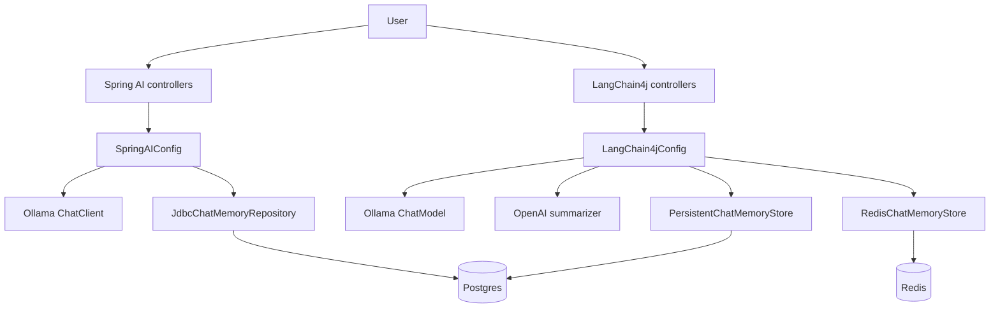

# springai-langchain4j-playground

This branch is a hands-on POC for exploring AI-backed chat flows in Spring Boot using both **Spring AI** and **LangChain4j**.

The repository is intentionally practical rather than polished. It is organized as a small lab where you can compare:

- plain prompt calls
- manual message history
- in-memory chat memory
- JDBC-backed chat memory
- JPA-backed chat memory
- Redis-backed chat memory
- message-window strategies
- token-window strategies
- summarization-based memory

The branch currently leans on a local **Ollama** model for the normal chat paths, a dedicated **OpenAI** model for the LangChain4j summarization strategy, **PostgreSQL** for SQL-backed persistence, and **Redis** for one of the LangChain4j memory store experiments.

---

## What This POC Is About

At a high level, the code is split into two tracks:

1. **Spring AI track**  
   This shows how `ChatClient`, `MessageChatMemoryAdvisor`, and Spring AI's JDBC memory repository behave in a simple controller-based app.

2. **LangChain4j track**  
   This shows how LangChain4j AI Services, custom `ChatMemoryStore` implementations, and multiple memory strategies behave when backed by local persistence or Redis.

The main value of the branch is not just answering questions. It is demonstrating how different memory and persistence strategies change the shape of a chat system.

---

## Big Picture



The branch has one shared application runtime, but several different chat modes.

---

## Repository Layout

The important files live under these paths:

```text
src/main/java/com/ai_playground/springai_langchian4j/
  SpringAILangChain4jApplication.java
  SpringAIConfig.java
  LangChain4jConfig.java
  controllers/
    GenerativeController.java
    ManualMemoryManagementController.java
    ChatMemorySpringAIController.java
    ChatMemoryLangchain4jController.java
  lc4j/
    ChatMessageEntity.java
    ChatMessageEntityRepository.java
    LocalTokenCountEstimator.java
    MessageSummaryChatMemory.java
    PersistentChatMemoryStore.java
    RedisStoreChatAssistantWithSlidingWindowStrategy.java
    SQLPersistedChatAssistantWithMessageSummarizationStrategy.java
    SQLPersistedChatAssistantWithSlidingWindowStrategy.java
    SQLPersistedChatAssistantWithTokenWindowStrategy.java

src/main/resources/
  application.properties
  coredeux-entities.yml

compose.yaml
pom.xml
```

---

## Main Scenarios Covered

This POC covers several different ways of handling chat:

- **no memory at all**
- **manual in-memory history**
- **Spring AI in-memory chat memory**
- **Spring AI persisted chat memory using `JdbcTemplate`**
- **LangChain4j in-memory assistant**
- **LangChain4j SQL-persisted assistant with sliding window memory**
- **LangChain4j SQL-persisted assistant with token window memory**
- **LangChain4j SQL-persisted assistant with summarization memory**
- **LangChain4j Redis-backed assistant with sliding window memory**

The controllers are deliberately separate so you can compare the same concept across implementations.

---

## Spring AI Side

### `SpringAIConfig`

This class owns the Spring AI beans.

Important methods:

- `chatClient(ChatClient.Builder builder)`  
  Creates the default `ChatClient` bean used by the non-memory examples.

- `chatMemory()`  
  Creates the Spring AI `ChatMemory` used by the in-memory memory demo.

- `memoryChatClient(ChatClient.Builder builder, ChatMemory chatMemory)`  
  Builds a `ChatClient` with `MessageChatMemoryAdvisor` using the in-memory `ChatMemory`.

- `chatMemoryRepository(JdbcTemplate jdbcTemplate)`  
  Creates a JDBC-backed `ChatMemoryRepository` using `JdbcChatMemoryRepository`.

- `persistedChatMemory(ChatMemoryRepository chatMemoryRepository)`  
  Creates the persistent Spring AI memory store using JDBC.

- `persistedChatClient(ChatClient.Builder builder, ChatMemory persistedChatMemory)`  
  Builds a second `ChatClient` with `MessageChatMemoryAdvisor`, this time backed by Postgres.

Why this matters:

- the plain `chatClient` keeps the simple examples uncluttered
- `memoryChatClient` demonstrates in-memory chat state
- `persistedChatClient` demonstrates durable state backed by Postgres

### `GenerativeController`

This controller is the simplest entry point.

Methods:

- `askAI(String question)` mapped to `GET /ask`
- `tellJoke(String topic)` mapped to `GET /joke`

These routes are useful because they show the basic Spring AI `ChatClient` flow without any memory involved.

### `ManualMemoryManagementController`

This controller shows what memory looks like when you manage it yourself.

Base path:

- `/conversation`

Methods:

- `noMemoryManagement(String input)` mapped to `GET /conversation/no-memory-management`
- `withMemoryManagement(String input)` mapped to `GET /conversation/with-memory-management`

The key difference is:

- `noMemoryManagement(...)` sends each request as a standalone prompt
- `withMemoryManagement(...)` appends messages into a local `List<Message>` and replays that history manually

This is a good comparison point because it shows why helper abstractions exist in the first place.

### `ChatMemorySpringAIController`

This controller is the Spring AI memory demo.

Base path:

- `/chat-memory-springai`

Methods:

- `noMemoryManagement(String input)` mapped to `GET /chat-memory-springai/no-memory-management`
- `manualMemoryManagement(String input)` mapped to `GET /chat-memory-springai/manual-memory-management`
- `inMemoryChat(String sessionId, String message)` mapped to `POST /chat-memory-springai/in-memory-chat`
- `persistedMemoryChat(String sessionId, String message)` mapped to `POST /chat-memory-springai/persisted-memory-chat`

What each route demonstrates:

- `noMemoryManagement(...)`  
  Plain one-shot prompt with no conversational context.

- `manualMemoryManagement(...)`  
  Controller-managed message list.

- `inMemoryChat(...)`  
  Uses `memoryChatClient` and `ChatMemory.CONVERSATION_ID` so Spring AI can keep session state in memory.

- `persistedMemoryChat(...)`  
  Uses `persistedChatClient` and JDBC-backed memory so the conversation survives beyond process memory.

This controller is the cleanest place to compare how Spring AI behaves with:

- no memory
- manual history
- transient memory
- durable memory

---

## LangChain4j Side

### `LangChain4jConfig`

This class owns the LangChain4j wiring.

Important beans and methods:

- `langchain4jOllamaChatModel(...)`  
  Creates the LangChain4j Ollama `ChatModel` manually with the bean name `"langchain4jOllamaChatModel"` so it does not collide with Spring AI's auto-configured Ollama bean.

- `inMemoryAssistant(...)`  
  Builds the basic LangChain4j assistant using `AiServices`.

- `persistentChatMemoryStore(...)`  
  Returns the JPA-backed `PersistentChatMemoryStore`.

- `persistentMemoryProvider(...)`  
  Creates a `MessageWindowChatMemory` that stores messages through the SQL-backed store.

- `sqlPersistedChatAssistantWithSlidingWindowStrategy(...)`  
  Binds the sliding-window SQL assistant.

- `tokenWindowProvider(...)`  
  Creates a `TokenWindowChatMemory` using `LocalTokenCountEstimator`.

- `tokenCountEstimator()`  
  Returns the local token estimator used by the token-window strategy.

- `sqlPersistedChatAssistantWithTokenWindowStrategy(...)`  
  Binds the SQL assistant that keeps a token budget instead of a message budget.

- `tokenSummarizationProvider(...)`  
  Builds the project-local `MessageSummaryChatMemory`.

- `sqlPersistedChatAssistantWithMessageSummarizationStrategy(...)`  
  Binds the summarization-based SQL assistant.

- `redisChatMemoryStore(...)`  
  Creates the Redis-backed LangChain4j `ChatMemoryStore`.

- `redisStoreMemoryProvider(...)`  
  Creates a `MessageWindowChatMemory` backed by Redis string storage.

- `redisStoreChatAssistantWithSlidingWindowStrategy(...)`  
  Binds the Redis-backed assistant.

This class is the heart of the LangChain4j POC. It shows how one assistant interface can be wired to different memory stores and different memory algorithms.

### `ChatMemoryLangchain4jController`

This controller exposes the LangChain4j demos.

Base path:

- `/chat-memory-lc4j`

Methods:

- `inMemoryChat(String sessionId, String message)` mapped to `POST /chat-memory-lc4j/in-memory-chat`
- `sqlPersistedMemoryChatWithSlidingWindowStrategy(String sessionId, String message)` mapped to `POST /chat-memory-lc4j/sql-persisted-memory-chat-with-sliding-window-strategy`
- `sqlPersistedMemoryChatWithTokenWindowStrategy(String sessionId, String message)` mapped to `POST /chat-memory-lc4j/sql-persisted-memory-chat-with-token-window-strategy`
- `sqlPersistedMemoryChatWithMessageSummarizationStrategy(String sessionId, String message)` mapped to `POST /chat-memory-lc4j/sql-persisted-memory-chat-with-message-summarization-strategy`
- `redisStoreChatWithSlidingWindowStrategy(String sessionId, String message)` mapped to `POST /chat-memory-lc4j/redis-store-chat-with-sliding-window-strategy`

This is the best place to compare the LangChain4j strategies side by side.

### `InMemoryAssistant`

This is a small interface that marks the standard LangChain4j assistant shape.

It is used as the base contract for:

- `SQLPersistedChatAssistantWithSlidingWindowStrategy`
- `SQLPersistedChatAssistantWithTokenWindowStrategy`
- `SQLPersistedChatAssistantWithMessageSummarizationStrategy`
- `RedisStoreChatAssistantWithSlidingWindowStrategy`

The branching here is done by memory strategy, not by changing the assistant interface.

### `ChatMessageEntity`

This JPA entity stores persisted LangChain4j messages in Postgres.

Fields:

- `pk`
- `memoryId`
- `message`
- `chatMessageType`

Why `memoryId` matters:

- it ties the row back to a chat session
- it is the key LangChain4j uses to reload history

### `ChatMessageEntityRepository`

This is the Spring Data JPA repository used by `PersistentChatMemoryStore`.

It gives the store database access for:

- `findByMemoryIdOrderByPkAsc(...)`
- `deleteByMemoryId(...)`
- batch save of messages through `saveAll(...)`

### `PersistentChatMemoryStore`

This class implements LangChain4j `ChatMemoryStore` using JPA.

Important methods:

- `getMessages(Object memoryId)`
- `updateMessages(Object memoryId, List<ChatMessage> messages)`
- `deleteMessages(Object memoryId)`

Behavior:

- `getMessages(...)` loads and deserializes chat rows for a session
- `updateMessages(...)` deletes the old rows for the session and writes the new message list
- `deleteMessages(...)` removes all rows for a session

This is the SQL persistence layer for the LangChain4j demos.

### `LocalTokenCountEstimator`

This is a small local implementation of LangChain4j `TokenCountEstimator`.

It is used by:

- `tokenWindowProvider(...)`

Reason it exists:

- the branch uses Ollama locally
- LangChain4j does not ship a generic Ollama tokenizer here
- the token-window strategy needs an estimator to work

### `MessageSummaryChatMemory`

This is a project-local summarization memory implementation.

Important methods:

- `add(ChatMessage message)`
- `messages()`
- `clear()`
- `set(Iterable<ChatMessage> messages)`
- `compact(List<ChatMessage> messages)`
- `summarize(List<ChatMessage> messagesToSummarize)`

What it does:

- loads persisted chat messages
- keeps the original system message
- preserves one explicit summary block
- keeps a small tail of recent raw messages
- summarizes the older part of the conversation with a dedicated OpenAI model

Important detail:

- this is **not** a built-in LangChain4j class in this branch's dependency line
- it is a local implementation that fills the gap for summary-based memory

### `RedisStoreChatAssistantWithSlidingWindowStrategy`

This is a marker interface for the Redis-backed assistant.

It follows the same pattern as the other LangChain4j assistant interfaces, but its memory comes from Redis instead of Postgres.

---

## Memory Strategies in Plain English

### 1. No memory

Used by:

- `GenerativeController.askAI(...)`
- `GenerativeController.tellJoke(...)`
- `ManualMemoryManagementController.noMemoryManagement(...)`
- `ChatMemorySpringAIController.noMemoryManagement(...)`

Behavior:

- every request is fresh
- the model sees only the current prompt

### 2. Manual message history

Used by:

- `ManualMemoryManagementController.withMemoryManagement(...)`

Behavior:

- the controller holds a local `List<Message>`
- previous turns are replayed manually
- this is useful as a baseline to understand what memory frameworks save you from

### 3. Spring AI in-memory chat memory

Used by:

- `ChatMemorySpringAIController.inMemoryChat(...)`

Behavior:

- Spring AI keeps the last N messages in memory
- session id is passed in via `ChatMemory.CONVERSATION_ID`

### 4. Spring AI persisted chat memory

Used by:

- `ChatMemorySpringAIController.persistedMemoryChat(...)`

Behavior:

- Spring AI stores messages through `JdbcChatMemoryRepository`
- data lives in Postgres instead of JVM memory

### 5. LangChain4j sliding window

Used by:

- `sqlPersistedMemoryChatWithSlidingWindowStrategy(...)`
- `redisStoreChatWithSlidingWindowStrategy(...)`

Behavior:

- keeps the most recent messages
- evicts older ones once the budget is exceeded

### 6. LangChain4j token window

Used by:

- `sqlPersistedMemoryChatWithTokenWindowStrategy(...)`

Behavior:

- keeps messages under a token limit instead of a simple message count
- the branch uses `LocalTokenCountEstimator`

### 7. LangChain4j summarization memory

Used by:

- `sqlPersistedMemoryChatWithMessageSummarizationStrategy(...)`

Behavior:

- older context is compressed into a summary
- the summary is preserved as a memory note
- the compacted history stays small enough for longer chats

### 8. LangChain4j Redis-backed memory

Used by:

- `redisStoreChatWithSlidingWindowStrategy(...)`

Behavior:

- chat memory is stored in Redis
- the branch config uses `StoreType.STRING` so a plain Redis instance works
- no RedisJSON module is required for this setup

---

## Configuration Overview

### `application.properties`

Current environment assumptions:

- Ollama runs at `http://localhost:11434`
- PostgreSQL runs at `jdbc:postgresql://localhost:5432/springai_langchain4j`
- Redis runs at `localhost:6379`
- OpenAI is available through `OPENAI_API_KEY`

Important properties:

```properties
spring.ai.model.chat=ollama
spring.ai.model.embedding=ollama
spring.ai.model.audio.speech=none
spring.ai.model.audio.transcription=none
spring.ai.model.image=none
spring.ai.model.moderation=none
spring.ai.ollama.base-url=http://localhost:11434
spring.ai.ollama.chat.options.model=llama3
spring.ai.ollama.embedding.options.model=llama3

spring.ai.chat.memory.repository.jdbc.initialize-schema=always

langchain4j.ollama.chat-model.base-url=http://localhost:11434
langchain4j.ollama.chat-model.model-name=llama3

langchain4j.open-ai.summary-chat-model.api-key=${OPENAI_API_KEY:}
langchain4j.open-ai.summary-chat-model.model-name=${OPENAI_MODEL:gpt-4o-mini}

langchain4j.redis.chat-memory.host=localhost
langchain4j.redis.chat-memory.port=6379

spring.datasource.url=jdbc:postgresql://localhost:5432/springai_langchain4j
spring.datasource.username=${POSTGRES_USER:postgres}
spring.datasource.password=${POSTGRES_PASSWORD:postgres}
```

### Why the branch uses multiple stores

- **Spring AI JDBC repository** is for Spring AI memory demos
- **JPA/Postgres** is for LangChain4j persistent memory demos
- **Redis** is for LangChain4j store experiments

That gives you three different persistence stories in one branch without collapsing them into a single abstraction.

---

## Dependencies

The main runtime dependencies are:

- Spring Boot 3.5.14
- Spring Web
- Spring Data JPA
- Spring AI OpenAI starter
- Spring AI Ollama starter
- Spring AI JDBC chat-memory repository starter
- LangChain4j Spring Boot starter
- LangChain4j Ollama module
- LangChain4j OpenAI module
- LangChain4j community Redis module
- PostgreSQL driver
- Coredeux starters

Java version:

- Java 21

---

## How To Run It

### Start Ollama

```powershell
docker compose -f compose.yaml up -d
```

### Run the app

```powershell
mvn spring-boot:run
```

### Or run from your IDE

If you prefer the IDE, make sure these services are running locally:

- Ollama
- PostgreSQL
- Redis

### OpenAI summarization

If you want the LangChain4j summary strategy to work, set:

- `OPENAI_API_KEY`

You can also override:

- `OPENAI_MODEL`

---

## How To Test The Endpoints

### Spring AI chat

- `GET /ask?question=...`
- `GET /joke?topic=...`

### Spring AI memory demos

- `GET /conversation/no-memory-management?input=...`
- `GET /conversation/with-memory-management?input=...`
- `POST /chat-memory-springai/in-memory-chat?sessionId=...`
- `POST /chat-memory-springai/persisted-memory-chat?sessionId=...`

### LangChain4j memory demos

- `POST /chat-memory-lc4j/in-memory-chat?sessionId=...`
- `POST /chat-memory-lc4j/sql-persisted-memory-chat-with-sliding-window-strategy?sessionId=...`
- `POST /chat-memory-lc4j/sql-persisted-memory-chat-with-token-window-strategy?sessionId=...`
- `POST /chat-memory-lc4j/sql-persisted-memory-chat-with-message-summarization-strategy?sessionId=...`
- `POST /chat-memory-lc4j/redis-store-chat-with-sliding-window-strategy?sessionId=...`

The memory routes all rely on the `sessionId` you pass in. That value becomes the conversation key.

---

## Postman Collection

The repository includes an exported Postman collection at:

- [`postman_collections/springai-langchian4j.postman_collection.json`](postman_collections/springai-langchian4j.postman_collection.json)

The collection is meant to give you a ready-made walkthrough of the POC without having to handcraft each request.

It is organized into these groups:

### `Basics`

This group covers the simplest Spring AI chat calls:

- `Ask AI`
  - maps to `GET /ask`
  - uses the `question` query parameter

- `Tell a Joke`
  - maps to `GET /joke`
  - uses the `topic` query parameter

### `Spring AI Chat Memory`

This group covers the Spring AI memory flows exposed by `ChatMemorySpringAIController`:

- `No Memory Management`
  - `POST /chat-memory-springai/no-memory-management`

- `Manual Memory Management`
  - `POST /chat-memory-springai/manual-memory-management`

- `In Memory Chat`
  - `POST /chat-memory-springai/in-memory-chat?sessionId=...`

- `Persisted Memory Chat`
  - `POST /chat-memory-springai/persisted-memory-chat?sessionId=...`

These requests let you compare:

- plain prompt handling
- manual replay of message history
- Spring AI in-memory conversation state
- Spring AI JDBC-backed conversation state

### `LangChain4j Chat Memory`

This group covers the LangChain4j memory flows exposed by `ChatMemoryLangchain4jController`:

- `In Memory Chat`
  - `POST /chat-memory-lc4j/in-memory-chat?sessionId=...`

- `SQL Persisted Memory Chat With Sliding Window Strategy`
  - `POST /chat-memory-lc4j/sql-persisted-memory-chat-with-sliding-window-strategy?sessionId=...`

- `SQL Persisted Memory Chat With Token Window Strategy`
  - `POST /chat-memory-lc4j/sql-persisted-memory-chat-with-token-window-strategy?sessionId=...`

- `SQL Persisted Memory Chat With Message Summarization Strategy`
  - `POST /chat-memory-lc4j/sql-persisted-memory-chat-with-message-summarization-strategy?sessionId=...`

- `Redis Store Chat With Sliding Window Strategy`
  - `POST /chat-memory-lc4j/redis-store-chat-with-sliding-window-strategy?sessionId=...`

These requests are the easiest way to compare:

- in-memory LangChain4j chat
- Postgres-backed sliding window memory
- Postgres-backed token window memory
- Postgres-backed summarization memory
- Redis-backed sliding window memory

### Collection variable

The collection uses a single variable:

- `{{host}}`

Set it to the base URL of your running app, for example:

```text
http://localhost:8080
```

That keeps the requests portable across local environments without having to edit each request individually.

---

## What To Read First

If you are new to this branch, start here:

1. `SpringAIConfig.chatClient(...)`
2. `ChatMemorySpringAIController.inMemoryChat(...)`
3. `ChatMemorySpringAIController.persistedMemoryChat(...)`
4. `LangChain4jConfig.langchain4jOllamaChatModel(...)`
5. `LangChain4jConfig.persistentMemoryProvider(...)`
6. `LangChain4jConfig.tokenWindowProvider(...)`
7. `LangChain4jConfig.tokenSummarizationProvider(...)`
8. `LangChain4jConfig.redisChatMemoryStore(...)`
9. `PersistentChatMemoryStore.updateMessages(...)`
10. `MessageSummaryChatMemory.compact(...)`

That sequence gives you a good mental model of the app from the edge inward.

---

## Notes And Caveats

- This is a POC, not a production architecture.
- There are multiple memory strategies on purpose; they are meant for comparison.
- `MessageSummaryChatMemory` is local to this repository.
- The Redis path uses plain string storage, not RedisJSON.
- The summarization lane uses OpenAI only for compaction; the rest of the LangChain4j flows still use Ollama.
- The Spring AI in-memory and persisted memory demos are separate from the LangChain4j memory demos.
- `coredeux-entities.yml` is present in the repo, but it is not the main story of this branch.

---

## Useful Files

- [`pom.xml`](pom.xml)
- [`compose.yaml`](compose.yaml)
- [`src/main/resources/application.properties`](src/main/resources/application.properties)
- [`src/main/java/com/ai_playground/springai_langchian4j/SpringAIConfig.java`](src/main/java/com/ai_playground/springai_langchian4j/SpringAIConfig.java)
- [`src/main/java/com/ai_playground/springai_langchian4j/LangChain4jConfig.java`](src/main/java/com/ai_playground/springai_langchian4j/LangChain4jConfig.java)
- [`src/main/java/com/ai_playground/springai_langchian4j/controllers/GenerativeController.java`](src/main/java/com/ai_playground/springai_langchian4j/controllers/GenerativeController.java)
- [`src/main/java/com/ai_playground/springai_langchian4j/controllers/ManualMemoryManagementController.java`](src/main/java/com/ai_playground/springai_langchian4j/controllers/ManualMemoryManagementController.java)
- [`src/main/java/com/ai_playground/springai_langchian4j/controllers/ChatMemorySpringAIController.java`](src/main/java/com/ai_playground/springai_langchian4j/controllers/ChatMemorySpringAIController.java)
- [`src/main/java/com/ai_playground/springai_langchian4j/controllers/ChatMemoryLangchain4jController.java`](src/main/java/com/ai_playground/springai_langchian4j/controllers/ChatMemoryLangchain4jController.java)
- [`src/main/java/com/ai_playground/springai_langchian4j/lc4j/PersistentChatMemoryStore.java`](src/main/java/com/ai_playground/springai_langchian4j/lc4j/PersistentChatMemoryStore.java)
- [`src/main/java/com/ai_playground/springai_langchian4j/lc4j/MessageSummaryChatMemory.java`](src/main/java/com/ai_playground/springai_langchian4j/lc4j/MessageSummaryChatMemory.java)
