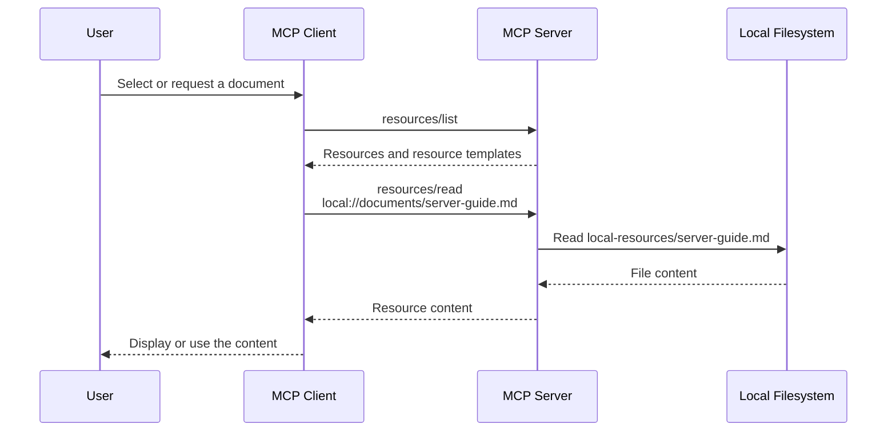
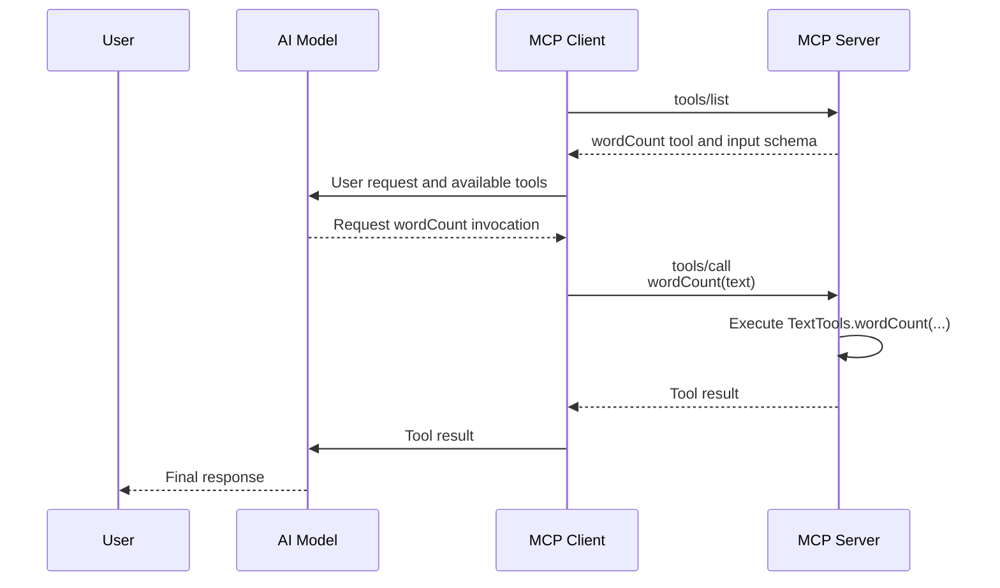
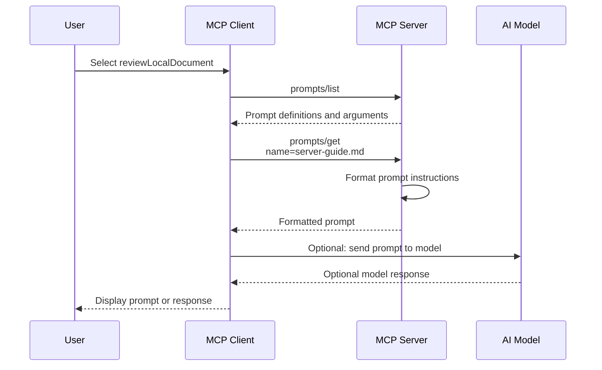

# springai-mcp-server

Standalone Spring Boot application that demonstrates MCP resources, tools, and prompts with Spring AI.

It is intentionally separate from the existing `springai-langchain4j` application. The MCP server does not require an LLM or an API key.

## Resources

| MCP resource URI | Purpose |
| --- | --- |
| `local://catalog` | Lists files available from the configured resource directory |
| `local://documents/{name}` | Reads one named local file |

Only direct files inside the configured resource directory are exposed. Requests that attempt to leave that directory are rejected.

## How MCP Clients Read Resources

An MCP resource is data that an MCP client explicitly requests from the server using its URI. It is similar to an HTTP `GET`, but the discovery and read operations use the MCP protocol.



The usual flow is:

1. The client calls `resources/list` to discover static resources such as `local://catalog`.
2. The client discovers resource templates such as `local://documents/{name}`.
3. The client calls `resources/read` with a specific URI.
4. The MCP server matches the URI to an `@McpResource` method.
5. The method executes on the MCP server and returns the resource content to the client.

For example, a client can request:

```json
{
  "method": "resources/read",
  "params": {
    "uri": "local://documents/server-guide.md"
  }
}
```

Spring AI matches that URI to:

```java
@McpResource(uri = "local://documents/{name}", name = "Local document")
public String document(String name)
```

Spring AI extracts `server-guide.md` as the `name` argument. The method then reads the file on the MCP server and returns its contents to the client.

Resources are not automatically added to an AI model's context. The MCP client decides when to read a resource and whether to send the returned content to a model. Depending on the client, resources may be selected manually, read by application code, or retrieved by an agent.

The `reviewLocalDocument` prompt instructs the client or model to read a resource URI, but the prompt itself does not perform the resource read.

| Capability | Typical initiator | Where it executes | Result |
| --- | --- | --- | --- |
| Prompt | User or client | MCP server formats it | Messages or instructions |
| Resource | MCP client | MCP server reads the data | Text or binary content |
| Tool | Model or client | MCP server executes the action | Tool execution result |

## Tool

| MCP tool | Purpose |
| --- | --- |
| `wordCount` | Counts words in supplied text without invoking an AI model |

## How MCP Clients Invoke Tools

An MCP tool is an operation that an MCP client or AI model can request the MCP server to execute. Tool discovery and invocation use the MCP protocol, while the actual Java method runs on the MCP server.



The usual flow is:

1. The client calls `tools/list` to discover available tools and their input schemas.
2. The client or model decides that a tool is needed.
3. The client calls `tools/call` with the tool name and arguments.
4. The MCP server matches the tool name to an `@McpTool` method.
5. The method executes on the MCP server and returns its result to the client.

For example, a client can request:

```json
{
  "method": "tools/call",
  "params": {
    "name": "wordCount",
    "arguments": {
      "text": "Spring AI MCP server"
    }
  }
}
```

Spring AI matches that request to:

```java
@McpTool(name = "wordCount", description = "Counts the words in a block of text.")
public int wordCount(
        @McpToolParam(description = "Text whose words should be counted.", required = true)
        String text)
```

The `wordCount` method executes inside this MCP server process. The client receives the returned count but does not execute the Java method locally.

Tools are commonly invoked by an AI model after the client supplies the model with the available tool definitions. However, an MCP client application can also call a tool directly without involving a model.

Example arguments:

```json
{
  "text": "Spring AI MCP server"
}
```

## Prompt

| MCP prompt | Purpose |
| --- | --- |
| `reviewLocalDocument` | Creates review instructions for one document exposed by the server |

## How MCP Clients Retrieve Prompts

An MCP prompt is a reusable prompt template stored and formatted by the MCP server. The server returns messages or instructions, but it does not automatically send them to an AI model.



The usual flow is:

1. The client calls `prompts/list` to discover available prompt templates and their arguments.
2. A user, application, or agent selects a prompt.
3. The client calls `prompts/get` with the prompt name and arguments.
4. The MCP server matches the prompt name to an `@McpPrompt` method.
5. The method formats and returns the prompt content.
6. The client decides whether to display the prompt, modify it, or send it to a model.

For example, a client can request:

```json
{
  "method": "prompts/get",
  "params": {
    "name": "reviewLocalDocument",
    "arguments": {
      "name": "server-guide.md"
    }
  }
}
```

Spring AI matches that request to:

```java
@McpPrompt(
        name = "reviewLocalDocument",
        description = "Creates a prompt for reviewing a document exposed by this MCP server.")
public String reviewLocalDocument(
        @McpArg(name = "name", description = "Name of the local document to review.", required = true)
        String name)
```

The MCP server formats and returns instructions containing `local://documents/server-guide.md`. Retrieving the prompt does not read that resource and does not invoke a model. The client must separately read the resource and decide how to use the prompt.

The prompt accepts a required `name` argument, such as `server-guide.md`, and directs the client to read `local://documents/server-guide.md` before reviewing it.

## Run

From the repository's `codebase` directory:

```powershell
cd springai-mcp-server
mvn spring-boot:run
```

The Streamable HTTP MCP endpoint is available at:

```text
http://localhost:8081/mcp
```

## Configure Local Resources

The default resource directory is:

```text
springai-mcp-server/local-resources
```

To expose a different directory:

```powershell
$env:MCP_RESOURCE_DIRECTORY = "C:\path\to\documents"
mvn spring-boot:run
```

The server treats resources as read-only and only reads direct files from the configured directory.

## Example MCP Client Configuration

Configure an MCP client that supports Streamable HTTP with:

```json
{
  "name": "springai-mcp-server",
  "url": "http://localhost:8081/mcp"
}
```

After connecting, the client can:

- list and read resources
- invoke the `wordCount` tool
- retrieve the `reviewLocalDocument` prompt

## Project Structure

```text
springai-mcp-server/
|-- local-resources/                         Sample local resources
|-- src/main/java/.../LocalResourceProvider.java
|-- src/main/java/.../LocalResourcePrompts.java
|-- src/main/java/.../TextTools.java
|-- src/main/resources/application.properties
|-- src/test/java/...                         Resource, tool, and prompt tests
`-- pom.xml
```

## Security Boundary

This example intentionally does not expose arbitrary filesystem paths. `LocalResourceProvider` resolves every requested filename against one configured root and verifies that the normalized path remains inside that root.
